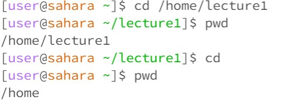
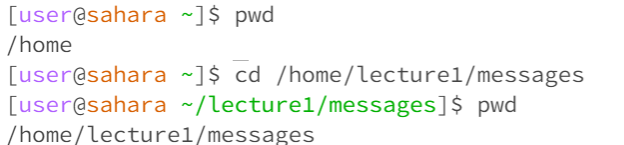
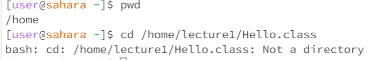
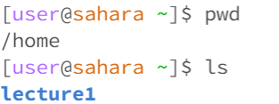
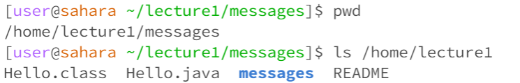
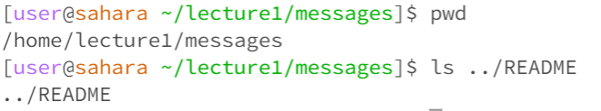
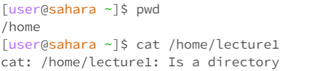
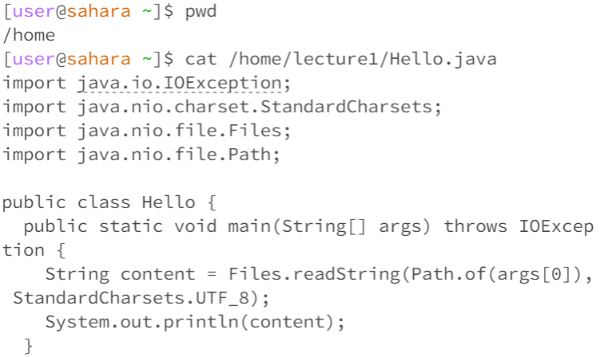

> # **Basic Filesystem Commands**

## **1. cd**
* cd stands for **changing directory**
* When you use this command, nothing returns because it is only changing the working directory which gives you no output (not an error!)
* The second line of the screenshot below shows the current working directory is **lecture1**, and after we use this command **cd** with  _**no arguments**_ , when we use pwd again to see our working directory, it is back to **/home**, so **cd with no arguments brings us back to home directory**

* Using this command with a path to a _**directory**_ as an argument will change your working directory to the given directory.
* In the screenshot below, the initial working directory is home, after we use the command cd with an absolute path to the *messages* directory, we can see that our working directory has also changed to the messages directory.

* Using this command with a path to a _**file**_ as an argument will lead to an error message.
*  In the screenshot below, the initial working directory is home, after we use the command cd with an absolute path to the Hello.class file, we can see the output saying that Hello.class is not a directory which means we cannot change our working directory to any files.

___
## **2. ls**
* ls stands for list
* Used to list the files and folders for the given path
* Using this command with _**no arguments**__ will give you the name of any directory and/or files as the output for the current working directory
* In the screenshot below, the working directory is **home**, so when using ls, the output is **lecture1** because it is the only directory under **home**
* The output is not an error

* Using this command with a _**path to a directory**_ as an argument will give the list of the names of any directory and/or files as the ouput for the given path of directory.
* In the screenshot below, even though the working directory is ~/lecture1/messages, however when we use the command ls using /home/lecture1 path, the output shows the directories and files under lecture1
* This means that no matter what the current working directory is, a path to a directory followed by ls determines what the output is going to be.

* Using this command with a _**path to a file**_ will return the path that you have just entered.
* In the screenshot below, the working directory is ~/lecture1/messages, but like I said above the working directory does not determine the output. When we use the path to a file, the output just returns the path that I have entered
* This is not an error because since a file won't have any directory or file under itself, so it returns itself

___
## **3. cat**
* cat stands for concatenate
* Used to print the contents of one or more files given by the paths
* Using this command with _**no arguments_ will give you a text editor, which means you can type in the blank space provided and also save it as a file.
* In the screenshot below, the working directory is home and after entering cat with no arguments, no output is shown but gives you space to type.
* This is not an error because it is used as a text editor.

* Using this command with a _**path to a directory**_ as an argument will give an error message, like the one in the screenshot below.
* The working directory is home
* This is not an error because this command cannot print out everything in the directory, it can only print out the information with a given file.

* Using this command with a _**path to a file**_ will print out the text in the given file
* In the screenshot below, the working directory is home, and the cat command is used to view the Hello.java file, so the output is the text in the Hello.java file.
* This is not an error because it did what we asked for

