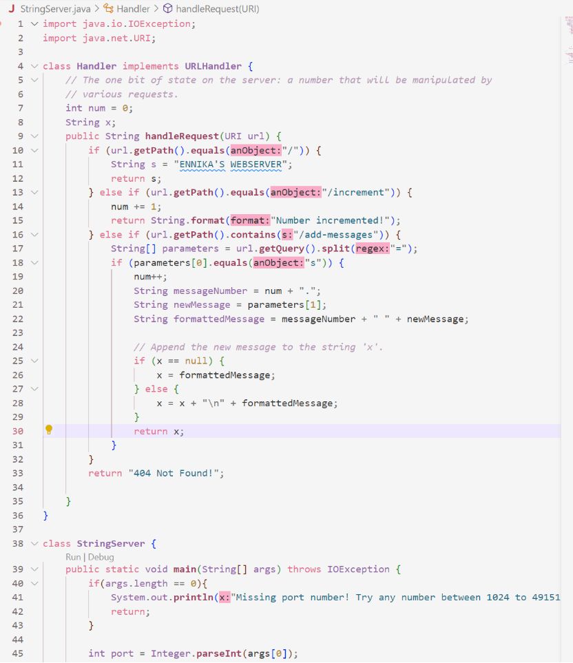
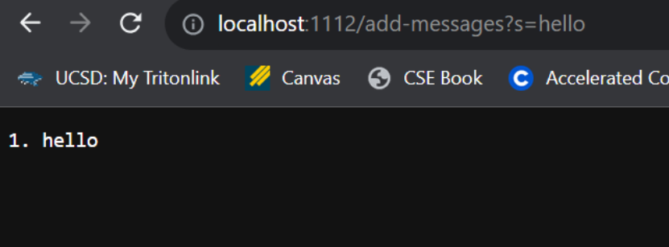
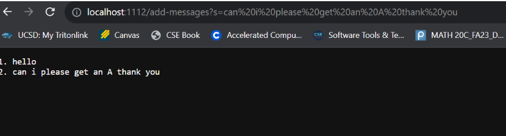
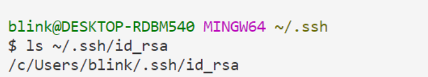
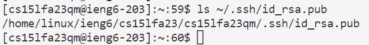
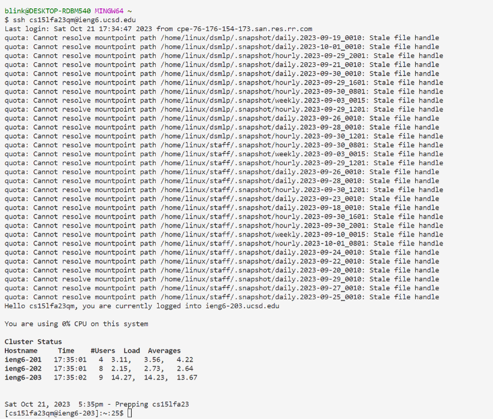

> # **Lab Report 2**

## **Part 1:**
Code for StringServer:

## **Screenshot 1 for using /add-messages:**

1. Which methods in your code are called?
  * The main method is first being called then it calls the Handler class which calls the handlerequest method.
2. What are the relevant arguments to those methods, and the values of any relevant fields of the class?
  * The URI object represents the request's URI and provides access to informatino about the requst's path and query parameters.
  * The int num field represents the number that gets incremented when a message is added. The initial value is 0.
  * The String x field is the field that stores the accumulated messages as a single string. The initial value is null.
3. How do the values of any relevant fields of the class change from this specific request?
  * After the request "add-messages?s=hello" is sent, int mum changes from 0 to 1 because a message is added. String x changes from null to "1. hello."

## **Screenshot 2 for using /add-messages:**

1. Which methods in your code are called?
  * The main method is first being called then it calls the Handler class which calls the handlerequest method.
2. What are the relevant arguments to those methods, and the values of any relevant fields of the class?
  * The URI object represents the request's URI and provides access to informatino about the requst's path and query parameters.
  * The int num field represents the number that gets incremented when a message is added. After the first request, the value is 1.
  * The String x field is the field that stores the accumulated messages as a single string. After the first request, the value is "1. hello."
3. How do the values of any relevant fields of the class change from this specific request?
  * After the request "add-messages?s=can i please get an A thank you" is sent, int mum changes from 1 to 2 because another message is added. String x changes from "1. hello" to "1. hello \n 2. can i please get an A thank you" because its is a new message being added to the existing message.

## **Part 2:**
* The path to the private key for my SSH key for logging into ieng6:
  
* The path to the public key for my SSH key for logging into ieng6:
  
* A terminal interaction where you log into ieng6 with my course-specific account without being asked for a password:
  

___
## **Part 3:**
* Something I have learned in the past few weeks of this course is basically everything so far because I had no idea or experience with this course other than the coding stuff but yeah learning about creating a new server and everything is pretty fun.

