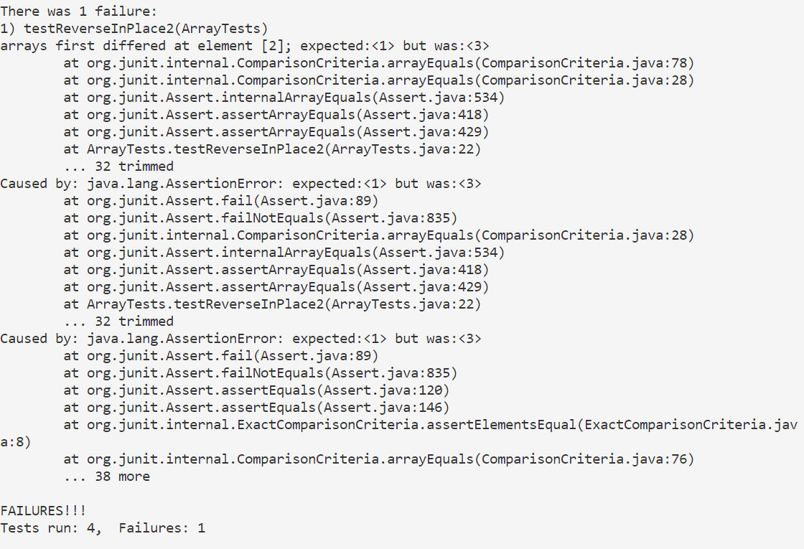

# **Lab Report 3**

## Part 1
The bug is in the ReverseInPlace method in ArrayTests.Java.
***
A failure-inducing input for the buggy program, as a JUnit test:
```
@Test
  public void testReverseInPlace2(){
    int[] input = {1, 2, 3};
    ArrayExamples.reverseInPlace(input);
    assertArrayEquals(new int[]{3, 2, 1}, input);
  }
```
An input that doesn’t induce a failure, as a JUnit test:
```
@Test
  public void testReverseInPlace3(){
    int[] input = {1,2,1};
    ArrayExamples.reverseInPlace(input);
    assertArrayEquals(new int[]{1,2,1}, input);
  }
```
The symptom, as the output of running the tests:


The bug, as the before-and-after code change required to fix it:
* Before:
```
static void reverseInPlace(int[] arr) {
    for(int i = 0; i < arr.length; i += 1) {
      arr[i] = arr[arr.length - i - 1];
    }
```
* After:
```
static void reverseInPlace(int[] arr) {
    for(int i = 0; i < arr.length/2; i += 1) {
      int temp = arr[i];
      arr[i] = arr[arr.length - i - 1];
      arr[arr.length-i-1]=temp;
    }
```
The bug is the method swaps the array into a symmetrical array since it only swaps the elements in the scond half with corresponding elements in the first half. The "after" code fixes the problem by only iterating through half of the array and using a temporary variable to hold the value of the element being swapped, ensuring that each element is swapped only once and thus correctly reversing the array.
***
## Part 2
* grep -C n: Prints searched line and n lines before and after the result (Citation: https://www.geeksforgeeks.org/grep-command-in-unixlinux/)
1. Example 1:
```
$ grep -C 1 "immune system function" technical/biomed/1471-213X-1-2.txt
        cellular behaviors. It is essential for animal development,
        immune system function, and wound repair. Defects in cell
        migration can lead to human diseases such as birth defects,
```
2. Example 2:
```
 $ grep -C 2 "homeodomain protein" technical/biomed/1471-213X-1-2.txt
        mec-3 gene [ 13, 14, 15]. 
        mec-3 in turn encodes a LIM
        homeodomain protein that is expressed in the six touch
        receptor neurons, two FLP neurons and two PVD neurons.
        MEC-3 and UNC-86 proteins form a heterodimer that binds to
```
This command line option is useful when you want to search for a significant vocabulary and the descriptions of it.
* grep -n: Display the matched lines and their line numbers (Citation: https://www.geeksforgeeks.org/grep-command-in-unixlinux/)
1. Example 1:
```
$ grep -n "homeodomain protein" technical/biomed/1471-213X-1-2.txt
103:        homeodomain protein that is expressed in the six touch
```
2. Example 2:
```
$ grep -n "immune system function" technical/biomed/1471-213X-1-2.txt
8:        immune system function, and wound repair. Defects in cell
```
This command line option is useful for long texts and you want to find where the significant word is immediately.
* grep -l: Display the file names that matches the pattern (Citation: https://www.geeksforgeeks.org/grep-command-in-unixlinux/)
1. Example 1:
```
$ grep -l "immune system function" technical/biomed/*.txt
technical/biomed/1471-213X-1-2.txt
```
2. Example 2:
```
$ grep -l "homeodomain protein" technical/biomed/*.txt
technical/biomed/1471-213X-1-2.txt
technical/biomed/1471-213X-1-4.txt
technical/biomed/gb-2002-3-8-research0038.txt
```
This command line option is useful when there are a large amount of files and you want to find the important ones with the topic that you want to know about.
* grep -c: This prints only a count of the lines that match a pattern (Citation: https://www.geeksforgeeks.org/grep-command-in-unixlinux/)
1. Example 1:
```
$ grep -c "cell" technical/biomed/1471-213X-1-2.txt
58
```
2. Example 2:
```
$ grep -c "function" technical/biomed/1471-213X-1-2.txt
3
```
This is useful in files with results of tests and you want to know how many errors has occurred by searching for the word "Error"
